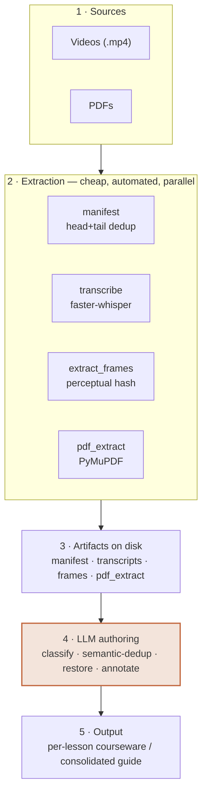

# vid2courseware

**Turn a pile of lecture videos into structured study courseware (Markdown).**
A modular pipeline: extract everything a model can read (transcripts, on-screen
slides, PDFs), then let an LLM classify, de-duplicate, restore the material, and
write it up — organized by topic, not by video.

> 把一堆讲课视频，变成「按主题组织、可直接学」的 Markdown 学习课件。
> 工具负责把视频拆成模型能读的东西（转写 / 屏幕截图 / PDF），LLM 负责理解、去重、还原、成稿。

---

## Why

A language model can't watch an `.mp4` or hear audio — it only reads **text and
images**. So the whole job is: **(1) extract** media into text + screenshots with
cheap automated tools, then **(2) reason** over that with an LLM.

The guiding principle throughout:

> **Cheap deterministic tools do the volume (batch, free, parallel, on your own
> GPU/CPU). The LLM does the judgment (classify, correct, distill, write).**

See [docs/architecture.md](docs/architecture.md) for the full design rationale.

## How it works



*Cheap deterministic tools do the volume; the LLM does the judgment.*

## What it does

- 🎞️ **Inventory + de-dup** a video corpus with a fast head+tail fingerprint (`core/manifest.py`)
- 🗣️ **Transcribe** with faster-whisper, incl. **mixed-language** audio via per-segment
  detection (`core/transcribe.py`) — ~40–50× realtime on a consumer GPU
- 🖼️ **Capture on-screen slides/documents** as keyframes, de-duplicated with a
  perceptual hash that survives scrolling text (`core/extract_frames.py`)
- 📄 **Extract existing PDFs** to Markdown text + images (`core/pdf_extract.py`)
- 📊 **Analyze** token budget and find *genuine* re-recordings via n-gram Jaccard (`core/analyze.py`)
- ✍️ **LLM authoring** then fuses these sources into the final courseware
  (conventions in [docs/editorial-rules.md](docs/editorial-rules.md))

## Two recipes

| Recipe | Source | When | Output |
|---|---|---|---|
| [`recipes/local_video`](recipes/local_video) | Local recordings (no captions) | You have the video files | Per-lesson folders: courseware + summary |
| [`recipes/youtube_subs`](recipes/youtube_subs) | A YouTube channel **with captions** | Captions exist → skip ASR | One consolidated guide by section |

## Quickstart

```bash
git clone https://github.com/Aster925/vid2courseware
cd vid2courseware
pip install -r requirements.txt
cp config.example.yaml config.yaml      # edit: your video folders, model, output dir

# local-video recipe
python -m core.manifest                  # inventory + de-dup
python -m core.transcribe --all --split-by-script
python -m core.extract_frames --seq 1    # on-screen slides for a lesson
python -m core.analyze                   # budget + re-recording check

# smoke-test analyze with the bundled synthetic samples (no GPU needed):
python -m core.analyze --dir examples
```

Then do the **LLM authoring** step (e.g. with Claude Code) following
[docs/editorial-rules.md](docs/editorial-rules.md).

## Repo layout

```
vid2courseware/
├── core/             # source-agnostic building blocks
│   ├── manifest.py        inventory + byte-dedup
│   ├── transcribe.py      faster-whisper (multilingual)
│   ├── extract_frames.py  perceptual-hash keyframes
│   ├── pdf_extract.py     PyMuPDF text + images
│   └── analyze.py         token budget + Jaccard redundancy
├── recipes/          # end-to-end flows for specific sources
│   ├── local_video/
│   └── youtube_subs/
├── docs/             # architecture & editorial rules
├── examples/         # tiny synthetic transcripts for a smoke test
└── config.example.yaml
```

## Requirements

- Python 3.9+
- **GPU optional but recommended** — NVIDIA + CUDA 12 gives ~40–50× realtime
  transcription. CPU works with a smaller model and `compute_type: int8`.
- ffmpeg is provided via the `imageio-ffmpeg` pip package (no system install).
- `yt-dlp` only for the YouTube recipe.

## Bring your own data ⚠️

This repo is the **tool**, not a content library. Videos, transcripts, and any
generated study material are **gitignored** — keep your own (and any copyrighted
course material) **out of public repos**. Respect the rights of the original
instructors/creators.

> 本仓库只提供工具，不含任何课程内容。视频/转写/生成的课件都已 gitignore，请勿把受版权
> 保护的课程材料放进公开仓库。

## Roadmap

Ideas and help wanted — see the [issues](https://github.com/Aster925/vid2courseware/issues):

- **Local OCR for keyframes** — auto-OCR captured slides (RapidOCR/PaddleOCR/Tesseract)
  so written courseware extraction scales without manual vision passes.
- **New recipe: burned-in subtitles** — OCR a fixed caption region for videos with
  hardcoded subs (no caption track, no clean audio).
- **Per-corpus language auto-config** for transcription, instead of fixed settings.
- **Smoke tests + CI** for the `core/` modules.

Contributions welcome — see [CONTRIBUTING.md](CONTRIBUTING.md).

## License

[MIT](LICENSE) © 2026 Aster925

*Built collaboratively with Claude Code. The two recipes come from real projects
(a French TEF Canada video archive and a CELPIP YouTube study guide).*
